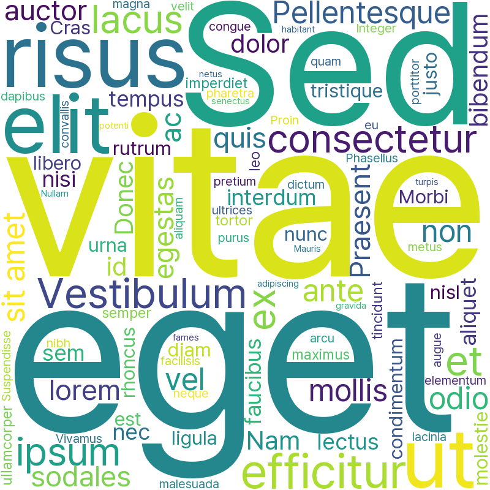

# COLOSUS


> wOrd CLOUd generator r/ perSonal emotion analysiS

<!-- markdownlint-configure-file { "MD033": false, "MD045": false } -->

## wordcloud module



---

```bash
> tree mod
mod
├── PretendardVariable.ttf
├── README.md
├── cloud.py
├── lorem-ipsum.txt
├── main.py
├── result.png
└── stopwords.txt
```
